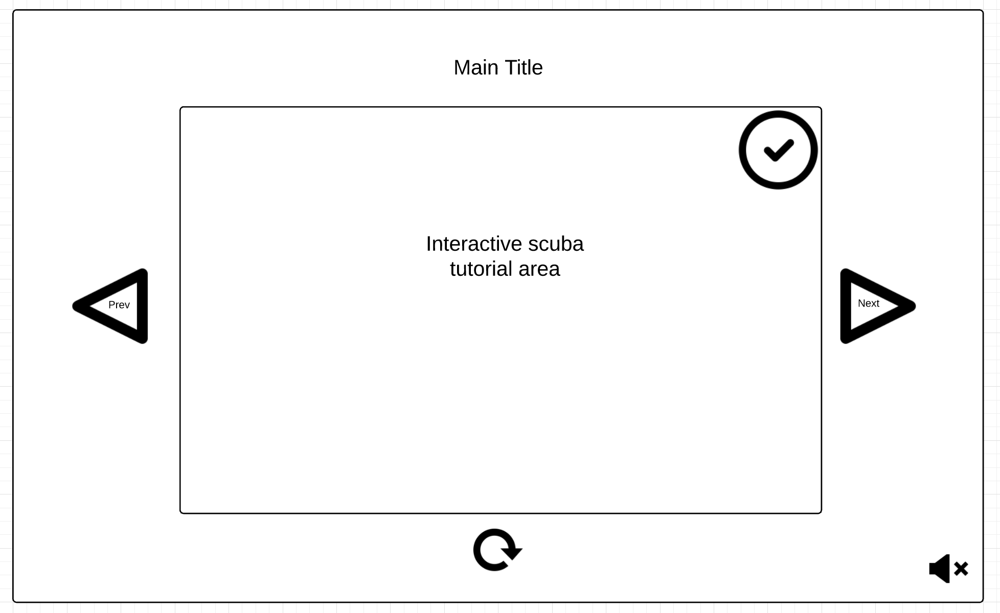

## Scuba Gear Setup

### Background

Safety comes first when it comes to scuba diving. That's why proper setup of your equipment is key! Follow this interactive guide to ensure safe setup of your scuba gear before you set off to explore the depths!

### Functionality & MVP  

With this scuba gear setup guide, users will be able to:

- [ ] Navigate between steps & select to start from the beginning
- [ ] Select equipment to expand for more information about the item
- [ ] Clearly read and understand the gear setup steps
- [ ] User is able to drag and drop equipment into place to move onto next step
- [ ] User will deflate the scuba diver's BC once equipment is set up to have the diver descend
- [ ] Fun and inspirational visuals that make the user feel underwater

In addition, this project will include:

- [ ] Scuba sounds playing in background
- [ ] A production Readme

### Wireframes

This app will consist of a single screen with an area for the interactive guide, step controls, and nav links to the Github and my LinkedIn. Guide controls will include Start, Next Step, Previous Step and Restart buttons. The user will be able to listen to underwater scuba sounds and a mute button will be available.

### Architecture and Technologies

This project will be implemented with the following technologies:

- Vanilla JavaScript and `jquery` for overall structure and game logic,
- `Easel.js` with `HTML5 Canvas` to help create the visual experience of being underwater and generation of the scuba equipment that the user will be setting up,
- Webpack to bundle and serve up the various scripts.

In addition to the webpack entry file, there will be three scripts involved in this project:

`board.js`: this script will handle the logic for creating and updating the necessary `Easel.js` elements and rendering them to the DOM.

### Implementation Timeline

**Day 1**: Setup all necessary Node modules, including getting webpack up and running and `Easel.js` installed.  Create `webpack.config.js` as well as `package.json`.  Write a basic entry file and the bare bones of all 3 scripts outlined above.  Learn the basics of `Easel.js`.  Goals for the day:

- Get a green bundle with `webpack`
- Learn enough `Easel.js` to render an object to the `Canvas` element
- Identify all components needed for the guide (info & images)

**Day 2**: Dedicate this day to learning the `Easel.js` API. Goals for the day:

- Create and complete the guide module (constructor, update functions)
- Create the `Canvas` using `Easel.js` where the interactive guide will be located
- Start work on the background bubbles

**Day 3**: Create the guide. Goals for the day:

- Create all the different steps of the guide
- Have the background with bubbles continuously floating to the top

**Day 4**: Install the controls for the user to interact with the guide. Style the frontend, making it polished and professional.  Goals for the day:

- Create controls for start, reset, next, and previous
- Have a styled `Canvas`, nice looking controls and title
